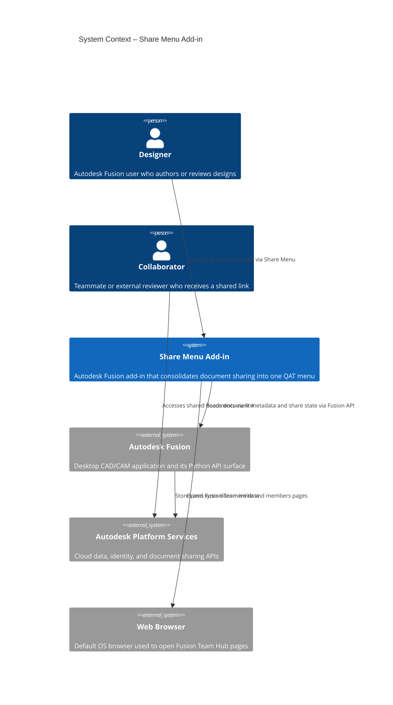
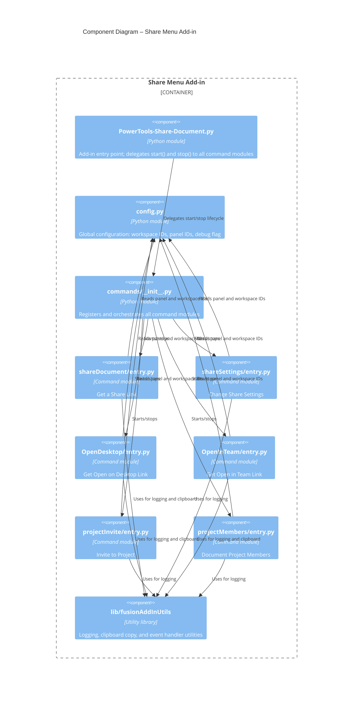
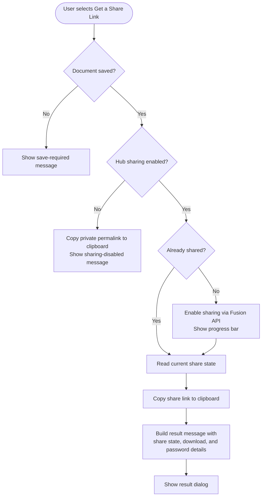
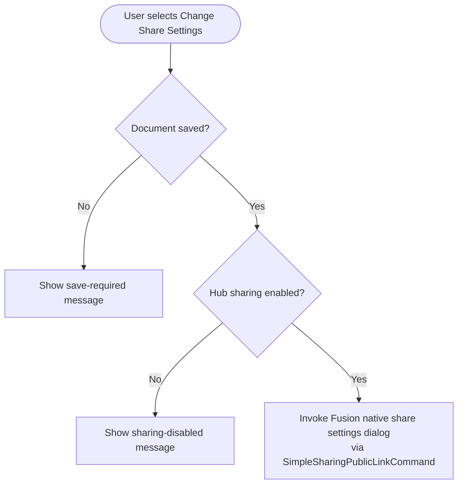
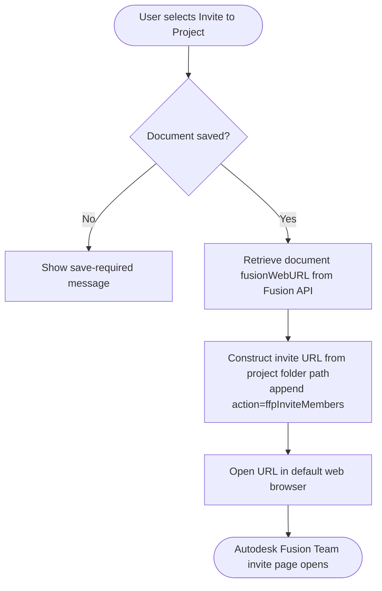
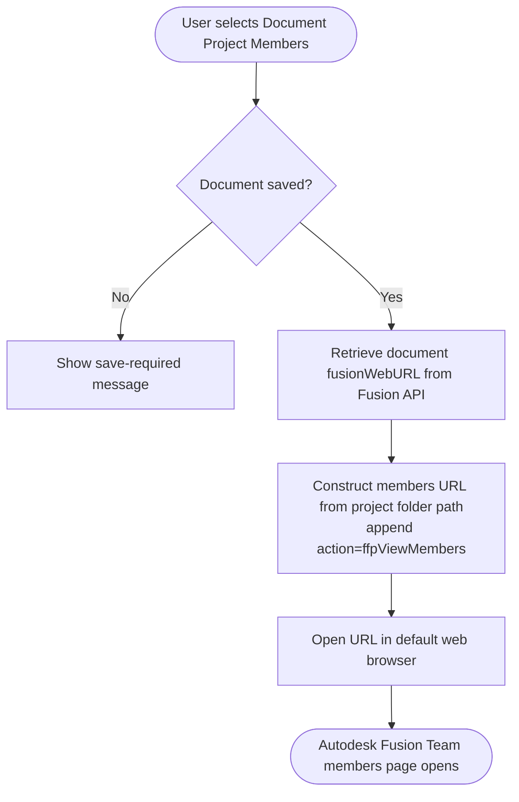
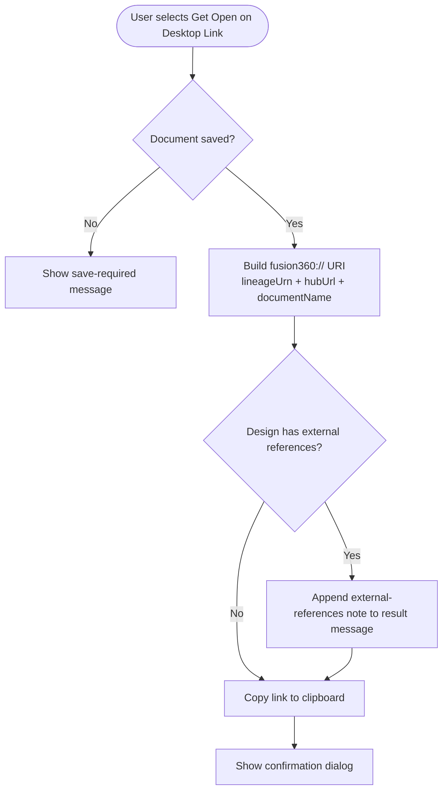
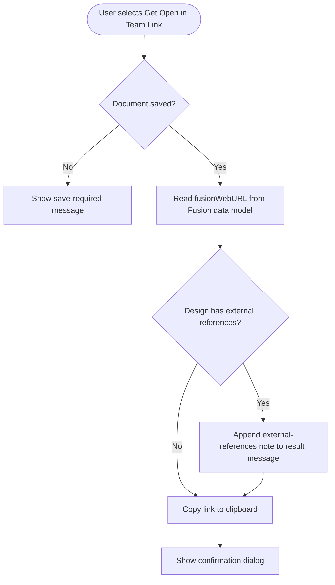

# Share Menu — PowerTools for Autodesk Fusion

The **Share Menu** add-in for Autodesk Fusion consolidates all document-sharing tools into a single, consistent drop-down menu in the right Quick Access Toolbar (QAT). This placement mirrors the convention used by modern productivity applications and reduces the steps required to collaborate. Instead of navigating multiple locations, you access every sharing action from one place.

---

## Contents

- [Prerequisites](#prerequisites)
- [Installation](#installation)
- [Accessing the Share Menu](#accessing-the-share-menu)
- [Commands](#commands)
  - [Get a Share Link](#get-a-share-link)
  - [Change Share Settings](#change-share-settings)
  - [Invite to Project](#invite-to-project)
  - [Document Project Members](#document-project-members)
  - [Get Open on Desktop Link](#get-open-on-desktop-link)
  - [Get Open in Team Link](#get-open-in-team-link)
- [Architecture](#architecture)
  - [System context](#system-context)
  - [Add-in component diagram](#add-in-component-diagram)
  - [Command flows](#command-flows)
- [Troubleshooting](#troubleshooting)
- [Contributing](#contributing)
- [License](#license)

---

## Prerequisites

Before you install the Share Menu add-in, verify that your environment meets the following requirements:

| Requirement | Details |
|---|---|
| **Autodesk Fusion** | Current release (Windows or macOS) |
| **Autodesk Team Hub** | Documents must reside in an Autodesk Team Hub |
| **Hub sharing enabled** | The Hub administrator must have sharing links enabled |
| **Saved document** | Sharing commands require the active document to be saved to the Hub |

---

## Installation

1. Download or clone this repository to your local computer.
2. In Autodesk Fusion, open the **Utilities** tab and choose **Add-Ins > Scripts and Add-Ins**.
3. On the **Add-Ins** tab, select the **+** button, and then browse to the folder that contains the downloaded files.
4. Select `PowerTools-Share-Document` and choose **Run**.
5. To load the add-in automatically each time Fusion starts, select the **Run on Startup** check box.

---

## Accessing the Share Menu

After the add-in is running, the **Share Menu** drop-down appears in the right Quick Access Toolbar at the top of the Fusion window, next to the **Extensions Manager** command. Select the menu to access all sharing commands.

---

## Commands

### Get a Share Link

**Enables sharing and copies the public share link to the system clipboard.**

Use this command to generate a shareable URL for the active document. You can paste the link into email messages, chat messages, or any other text to share the document with others.

#### Behavior

- If the document has not been shared previously, sharing is enabled automatically before the link is generated.
- The share link is copied to the system clipboard.
- A result dialog reports the sharing state and includes relevant notes about the current share configuration.

The result dialog provides status indicators for the following conditions:

| Condition | Dialog note |
|---|---|
| Document was already shared | Reported in result message |
| Downloading from the link is disabled | Noted; directs user to **Change Share Settings** |
| Share link is password protected | Noted in result message |
| External references present, download enabled | Recipients can download referenced designs |
| External references present, download disabled | Referenced designs can be viewed but not downloaded |

#### Requirements and limitations

- The document must be saved to an Autodesk Team Hub.
- If the Team Hub administrator has disabled share links, a private permalink is copied to the clipboard instead. This private permalink provides Hub members with access to the document details page only.

---

### Change Share Settings

**Opens the Fusion share settings dialog for the active document.**

Use this command to modify the following sharing options without leaving the Share Menu:

| Setting | Description |
|---|---|
| **Sharing on/off** | Enable or disable the public share link for the document |
| **Allow download** | Allow or prevent recipients from downloading the document |
| **Password protection** | Add or remove a password required to access the share link |

#### Requirements and limitations

- The document must be saved to an Autodesk Team Hub.
- If the Team Hub administrator has disabled sharing, this command is unavailable.

---

### Invite to Project

**Opens the Autodesk Fusion Team web client to the Invite Members page for the active document's project.**

Use this command to add collaborators to the Hub project that contains the active document. After a member is invited, you can assign them the appropriate access permissions from within Fusion Team.

> **Note:** You must have the required Hub permissions to invite members. If you do not have permission, contact your Fusion Hub administrator.

#### Behavior

1. The add-in constructs a direct URL to the project invite page, based on the current document's Hub location.
2. The URL opens in your default web browser, taking you directly to the invite experience.

#### Requirements and limitations

- The document must be saved.
- The document must be stored in an Autodesk Hub project, not as a local file.

---

### Document Project Members

**Opens the Autodesk Fusion Team web client to the Members page for the active document's project.**

Use this command to view and manage the users and groups that have access to the project that contains the active document. From the Fusion Team web client page you can:

- View current members and their permission levels.
- Add new collaborators.
- Modify or remove existing access permissions.

> **Note:** You must have the required Hub permissions to manage members. If you do not have permission, contact your Fusion Hub administrator.

#### Behavior

1. The add-in constructs a direct URL to the project members page, based on the current document's Hub location.
2. The URL opens in your default web browser.

#### Requirements and limitations

- The document must be saved.
- The document must be stored in an Autodesk Hub project.

---

### Get Open on Desktop Link

**Copies a deep link to the system clipboard that opens the active document directly in Autodesk Fusion on the recipient's computer.**

Use this command to generate a `fusion360://` protocol link for the active document. When a teammate receives and selects this link, Autodesk Fusion opens on their computer and loads the document for editing.

This link type is most effective when sharing with design team members who all work in Autodesk Fusion and are members of the same Hub. Unlike public share links—which are suited for external reviewers and web-browser access—Open on Desktop links streamline collaboration among authors and editors who need direct edit access.

#### Behavior

- The add-in constructs a `fusion360://` URI that encodes the document lineage URN, the Hub URL, and the document name.
- The link is copied to the system clipboard.
- A confirmation dialog confirms the link was copied and notes any external references.

> **Note:** The recipient must be a Hub member and have permission to access the document. This link works only for recipients who have Autodesk Fusion installed on their computer.

#### Requirements and limitations

- The document must be saved.
- The recipient must have Autodesk Fusion installed and be a member of the Hub.

---

### Get Open in Team Link

**Copies to the system clipboard a direct link that opens the active document in the Autodesk Fusion Team web client.**

Use this command to generate the Fusion Team web URL for the active document. When a teammate selects this link, the document opens in the Autodesk Fusion Team web viewer.

This link type is most useful when sharing with extended team members who need to review a design in a browser without requiring a local Fusion installation.

#### Behavior

- The add-in retrieves the `fusionWebURL` for the active document from the Autodesk Platform Services data model.
- The link is copied to the system clipboard.
- A confirmation dialog confirms the link was copied and notes any external references.

#### Requirements and limitations

- The document must be saved.
- The recipient must have access to the Hub that contains the document.

---

## Architecture

### System context

The following diagram shows the Share Menu add-in in the context of its users and external systems.

### Add-in component diagram

The following diagram shows the internal structure of the add-in.

### Command flows

#### Get a Share Link

#### Change Share Settings

#### Invite to Project

#### Document Project Members

#### Get Open on Desktop Link

#### Get Open in Team Link

---

## Troubleshooting

| Symptom | Possible cause | Resolution |
|---|---|---|
| Share link cannot be generated | Sharing is disabled in the Team Hub | Contact your Fusion Hub administrator to enable sharing |
| A private permalink is copied instead of a share link | Team Hub sharing is disabled | Work with your Hub administrator to enable sharing |
| **Invite to Project** or **Document Project Members** pages don't open | Document is not saved, or the browser is blocking pop-ups | Save the document; allow pop-ups from Autodesk domains in your browser settings |
| Open on Desktop link does not launch Fusion | Fusion is not installed on the recipient's computer, or the protocol handler is not registered | Ensure the recipient has Autodesk Fusion installed |
| Commands don't appear after loading the add-in | Add-in failed to load | Check the **Text Commands** window in Fusion for error messages; verify that `DEBUG = True` in `config.py` for verbose output |
| Share settings dialog doesn't open | Document is not saved | Save the document and try again |

---

## Contributing

Contributions are welcome. To contribute:

1. Fork the repository.
2. Create a feature branch: `git checkout -b feature/your-feature-name`
3. Commit your changes with clear, descriptive messages.
4. Push to your fork and open a pull request against `main`.

Set `DEBUG = True` in [config.py](config.py) during development to enable verbose logging in the Fusion **Text Commands** window.

---

## License

This project is released under the [MIT License](LICENSE).
