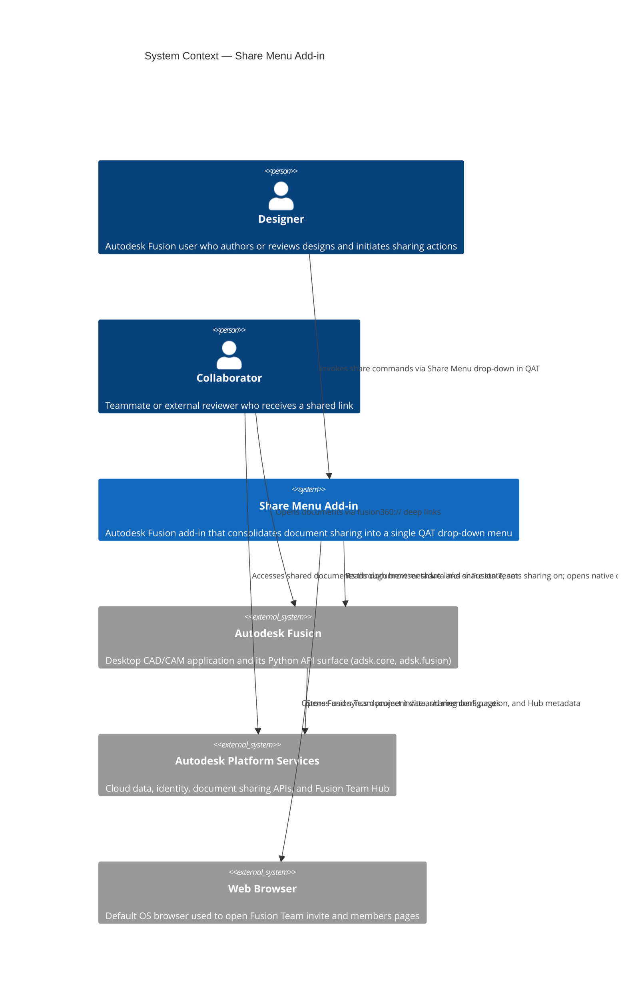
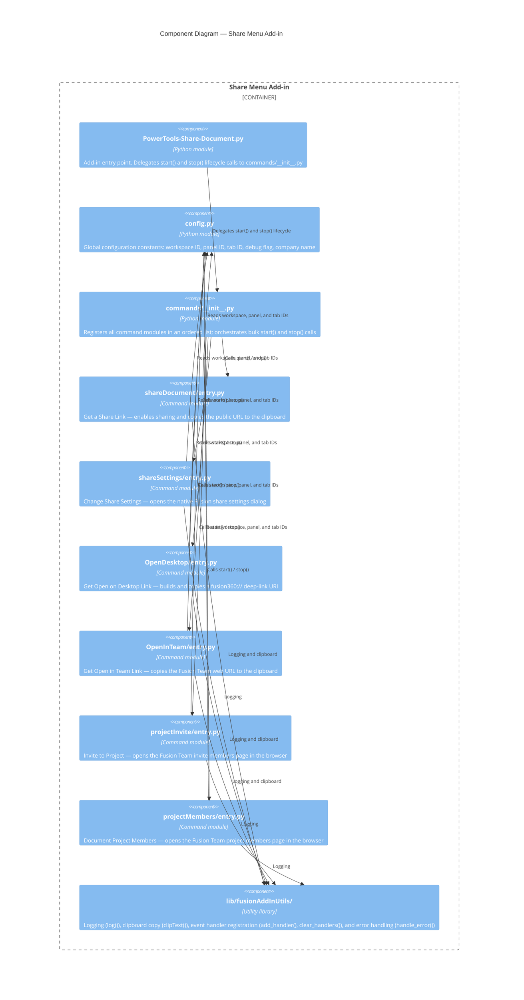
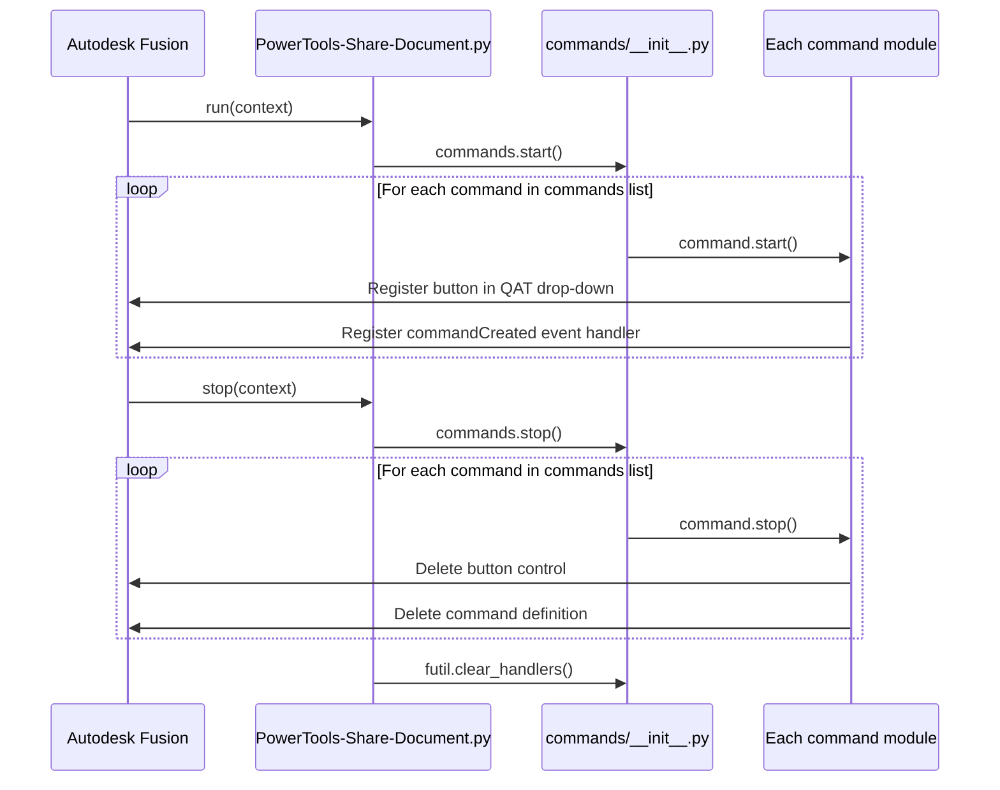
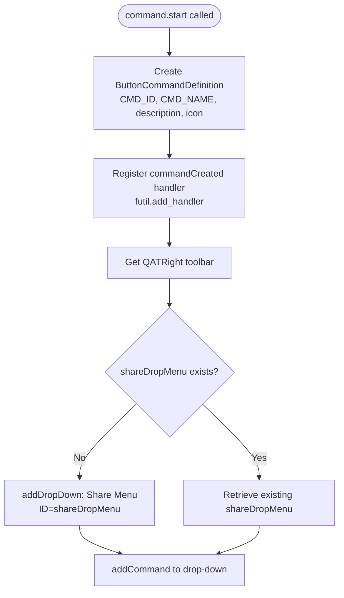

# Architecture

This document describes the internal structure and runtime behavior of the **Share Menu** add-in for Autodesk Fusion. It uses the [C4 model](https://c4model.com/) to represent the system at three levels of detail: system context, container/component structure, and individual command flows.

---

## Contents

- [Architecture](#architecture)
  - [Contents](#contents)
  - [System context](#system-context)
  - [Component structure](#component-structure)
  - [Add-in lifecycle](#add-in-lifecycle)
  - [Command registration](#command-registration)
  - [Command execution model](#command-execution-model)
  - [Utility library](#utility-library)
    - [`general_utils.py`](#general_utilspy)
    - [`event_utils.py`](#event_utilspy)
  - [Configuration module](#configuration-module)
  - [File structure reference](#file-structure-reference)

---

## System context

The following diagram shows the Share Menu add-in in the context of its users and the external systems it interacts with.



---

## Component structure

The following diagram shows the internal module structure of the add-in.



---

## Add-in lifecycle

Autodesk Fusion calls `run(context)` when the add-in loads and `stop(context)` when it unloads. Both functions delegate directly to `commands.start()` and `commands.stop()` respectively.



---

## Command registration

Each command module follows a consistent registration pattern during `start()`:

1. Create a `ButtonCommandDefinition` with an ID, display name, description, and icon folder path.
2. Register a `commandCreated` event handler on the definition using `futil.add_handler()`.
3. Locate the `QATRight` toolbar (right Quick Access Toolbar).
4. Create or retrieve the `shareDropMenu` drop-down control.
5. Add the button to the drop-down, specifying an optional sibling command ID for ordering.



---

## Command execution model

When the user selects a command from the Share Menu, Fusion fires the `commandCreated` event. The handler connects two additional events: `execute` and `destroy`. Because none of the commands present a dialog with inputs, `execute` fires immediately after `commandCreated`.

```mermaid
sequenceDiagram
    participant User
    participant Fusion as Autodesk Fusion
    participant Handler as command_created handler
    participant Execute as command_execute handler
    participant Destroy as command_destroy handler

    User->>Fusion: Selects command from Share Menu
    Fusion->>Handler: commandCreated event
    Handler->>Fusion: Register execute handler
    Handler->>Fusion: Register destroy handler
    Fusion->>Execute: execute event (no dialog inputs)
    Execute->>Execute: Validate preconditions (isSaved, isShareAllowed)
    Execute->>Execute: Perform command action
    Execute->>Fusion: Return
    Fusion->>Destroy: destroy event
    Destroy->>Destroy: Clear local_handlers list
```

---

## Utility library

The `lib/fusionAddInUtils/` package provides three shared utilities used by all command modules:

### `general_utils.py`

| Function | Signature | Description |
|---|---|---|
| `log` | `log(message, level, force_console)` | Writes a message to the Python console and, when `DEBUG=True` or `force_console=True`, to the Fusion **Text Commands** window. Errors are always written to the Fusion log file. |
| `clipText` | `clipText(linkText)` | Copies a string to the system clipboard. Uses `clip.exe` via `subprocess` on Windows and `pbcopy` via `os.system` on macOS. |
| `handle_error` | `handle_error(name, show_message_box)` | Logs the current exception traceback at error level. Optionally displays the error in a Fusion message box. |

### `event_utils.py`

| Function | Signature | Description |
|---|---|---|
| `add_handler` | `add_handler(event, callback, *, name, local_handlers)` | Dynamically resolves the correct handler type from the event module, creates a handler instance that calls `callback`, and appends it to either `local_handlers` or the global `_handlers` list to prevent garbage collection. |
| `clear_handlers` | `clear_handlers()` | Empties the global `_handlers` list, releasing all globally scoped event handlers. Called during add-in stop. |

---

## Configuration module

`config.py` defines the following constants used by all command modules:

| Constant | Value | Purpose |
|---|---|---|
| `DEBUG` | `False` | When `True`, all `futil.log()` calls write to the Fusion **Text Commands** window. Set to `True` during development. |
| `ADDIN_NAME` | Derived from folder name | The add-in's display name. |
| `COMPANY_NAME` | `"Autodesk"` | Company attribution string. |
| `design_workspace` | `"FusionSolidEnvironment"` | The Fusion workspace ID used for panel placement. |
| `tools_tab_id` | `"SolidTab"` | The Fusion tab ID used for panel placement. |
| `my_tab_name` | `"Power Tools"` | Display name for the Power Tools tab group. |
| `my_panel_id` | `"PT_Power Tools"` | Unique ID for the Power Tools panel. |
| `my_panel_name` | `"Power Tools"` | Display name for the panel. |
| `my_panel_after` | `""` | Sibling panel ID for ordering (empty = append). |

---

## File structure reference

```
PowerTools-Share-Document/
├── PowerTools-Share-Document.py   # Add-in entry point (run / stop)
├── PowerTools-Share-Document.manifest
├── config.py                      # Global constants
├── commands/
│   ├── __init__.py                # Command registry and bulk lifecycle
│   ├── shareDocument/
│   │   └── entry.py               # Get a Share Link
│   ├── shareSettings/
│   │   └── entry.py               # Change Share Settings
│   ├── OpenDesktop/
│   │   └── entry.py               # Get Open on Desktop Link
│   ├── OpenInTeam/
│   │   └── entry.py               # Get Open in Team Link
│   ├── projectInvite/
│   │   └── entry.py               # Invite to Project
│   └── projectMembers/
│       └── entry.py               # Document Project Members
├── lib/
│   └── fusionAddInUtils/
│       ├── __init__.py
│       ├── general_utils.py       # log(), clipText(), handle_error()
│       └── event_utils.py         # add_handler(), clear_handlers()
└── docs/
    ├── architecture.md            # This document
    └── commands/
        ├── get-a-share-link.md
        ├── change-share-settings.md
        ├── invite-to-project.md
        ├── document-project-members.md
        ├── get-open-on-desktop-link.md
        └── get-open-in-team-link.md
```
