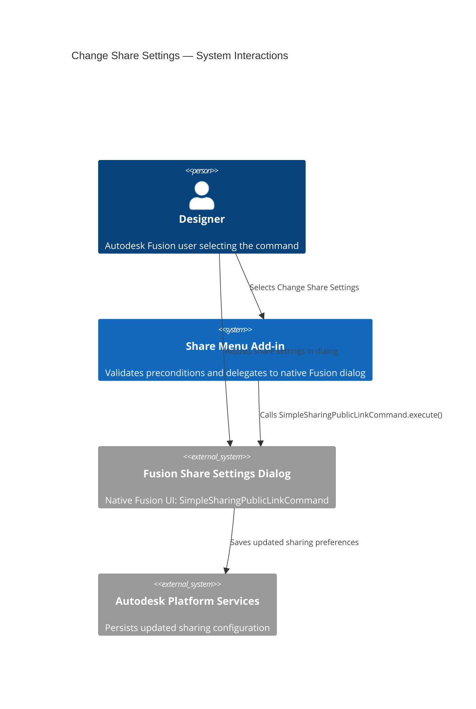
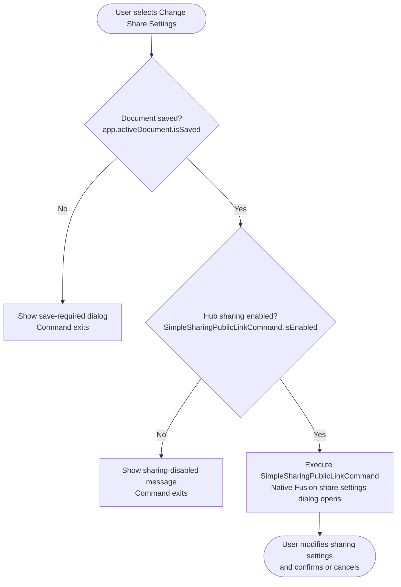

# Change Share Settings

**Opens the Autodesk Fusion share settings dialog for the active document.**

Use this command to view and modify the sharing options for the active document. You can control whether the document is publicly shared, whether recipients can download it, and whether a password is required to access the share link — all without navigating away from the Share Menu.

---

## When to use this command

| Scenario | Recommendation |
|---|---|
| Enable or disable the public share link | Use **Change Share Settings** |
| Restrict or allow recipient document downloads | Use **Change Share Settings** |
| Add or remove a share link password | Use **Change Share Settings** |
| Generate a new share link for the first time | Use [Get a Share Link](get-a-share-link.md) instead |

---

## How to use this command

1. Open a document that has been saved to an Autodesk Team Hub.
2. Select **Share Menu** in the right Quick Access Toolbar.
3. Select **Change Share Settings**.
4. The Autodesk Fusion share settings dialog opens.
5. Adjust the settings as required and confirm your changes.

---

## Available settings

The native Fusion share settings dialog exposes the following options:

| Setting | Description |
|---|---|
| **Sharing on/off** | Enable or disable the public share link for the document. Disabling sharing removes public access immediately. |
| **Allow download** | Allow or prevent recipients from downloading a local copy of the document. When disabled, recipients can only view the document in their browser and cannot export it. |
| **Password protection** | Add a password that recipients must enter before they can access the share link. Clear the password to remove protection. |

---

## Requirements and limitations

- The document must be saved to an Autodesk Team Hub.
- If the Team Hub administrator has disabled sharing for the Hub, this command displays a message and exits. The settings dialog is not opened.
- Changing share settings for a document that has never been shared does not automatically enable sharing. Use [Get a Share Link](get-a-share-link.md) to enable sharing first.

---

## Architecture — command flow

The following diagram shows what the add-in does when you select **Change Share Settings**.

### Detailed command flow

---

## Key API surface

| API element | Purpose |
|---|---|
| `ui.commandDefinitions.itemById("SimpleSharingPublicLinkCommand")` | Retrieves the native Fusion share command and checks whether sharing is enabled |
| `controlDefinition.isEnabled` | Reflects the Hub administrator's sharing policy |
| `app.activeDocument.isSaved` | Guards against operating on unsaved documents |
| `commandDefinitions.itemById("SimpleSharingPublicLinkCommand").execute()` | Opens the native Fusion share settings dialog |

---

## Related commands

- [Get a Share Link](get-a-share-link.md) — Enable sharing and copy the share link to the clipboard.
- [Get Open on Desktop Link](get-open-on-desktop-link.md) — Generate a link that opens the document for editing in Fusion.
- [Get Open in Team Link](get-open-in-team-link.md) — Generate a link that opens the document in the Fusion Team web viewer.
