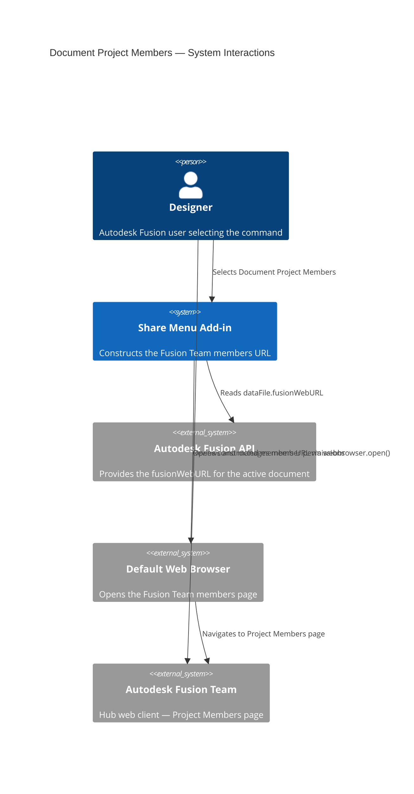
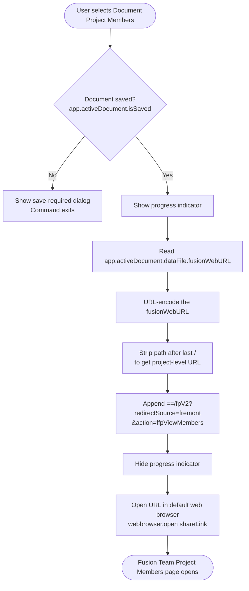

# Document Project Members

**Opens the Autodesk Fusion Team web client to the Members page for the active document's project.**

Use this command to view and manage all users and groups that have access to the project containing the active document. From the Fusion Team Members page you can review current access levels, add collaborators, and modify or remove existing permissions — without manually navigating the Fusion Team web interface.

---

## When to use this command

| Scenario | Recommendation |
|---|---|
| View who has access to the current project | Use **Document Project Members** |
| Modify or revoke an existing member's permissions | Use **Document Project Members** |
| Add a new member to the project | Use [Invite to Project](invite-to-project.md) instead |

---

## How to use this command

1. Open a document that is saved to an Autodesk Team Hub project.
2. Select **Share Menu** in the right Quick Access Toolbar.
3. Select **Document Project Members**.
4. Your default web browser opens directly to the **Members** page for the project.
5. Review, add, modify, or remove member permissions as required.

> **Note:** You must have sufficient Hub permissions to manage project members. If you do not have permission, contact your Fusion Hub administrator.

---

## Capabilities available on the Members page

From the Fusion Team Members page that this command opens, you can:

- View all current members and their assigned roles (for example, **Admin**, **Contributor**, **Viewer**).
- Add new members by entering their email addresses.
- Change an existing member's role.
- Remove a member's access to the project.

---

## Requirements and limitations

- The document must be saved.
- The document must be stored in an Autodesk Hub project. Local files or unsaved documents do not have a project context.
- You must have the Hub role that permits managing members (typically **Admin** or **Project Admin**).
- Your browser must be able to reach `autodesk.com` domains. If your browser blocks pop-ups from these domains, allow them in your browser settings.

---

## Architecture — command flow

The following diagram shows what the add-in does when you select **Document Project Members**.

### Detailed command flow

---

## URL construction

The add-in derives the members URL from `dataFile.fusionWebURL`, which points to the active document's page on Fusion Team. The construction process:

1. Reads the document's `fusionWebURL` (for example, `https://autodesk.com/team/hubs/.../projects/.../data/.../files/...`).
2. Trims the path to the project level by removing everything after the last `/`.
3. Appends the query string `==/fpV2?redirectSource=fremont&action=ffpViewMembers` to redirect to the Members page.

This pattern is identical to [Invite to Project](invite-to-project.md), but uses the `ffpViewMembers` action instead of `ffpInviteMembers`.

---

## Key API surface

| API element | Purpose |
|---|---|
| `app.activeDocument.isSaved` | Guards against operating on unsaved documents |
| `app.activeDocument.dataFile.fusionWebURL` | Base URL used to construct the members page URL |
| `urllib.parse.quote` / `urllib.parse.unquote` | URL encoding and decoding during path manipulation |
| `webbrowser.open(url)` | Opens the constructed URL in the system default browser |

---

## Related commands

- [Invite to Project](invite-to-project.md) — Send invitations to add new members to the project.
- [Get a Share Link](get-a-share-link.md) — Share the document publicly without modifying project membership.
