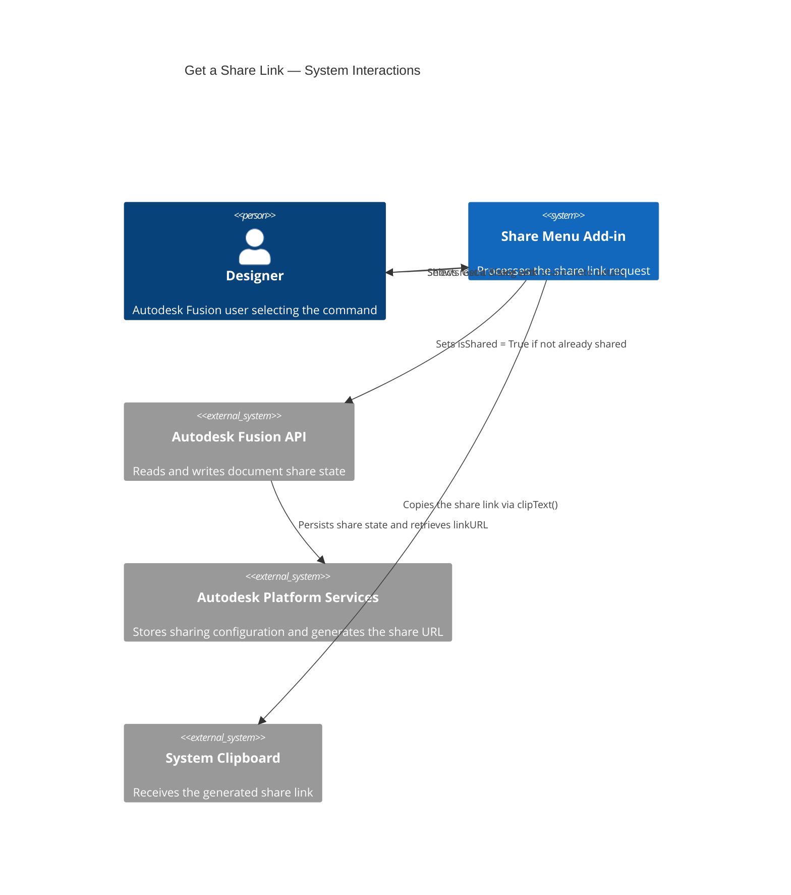
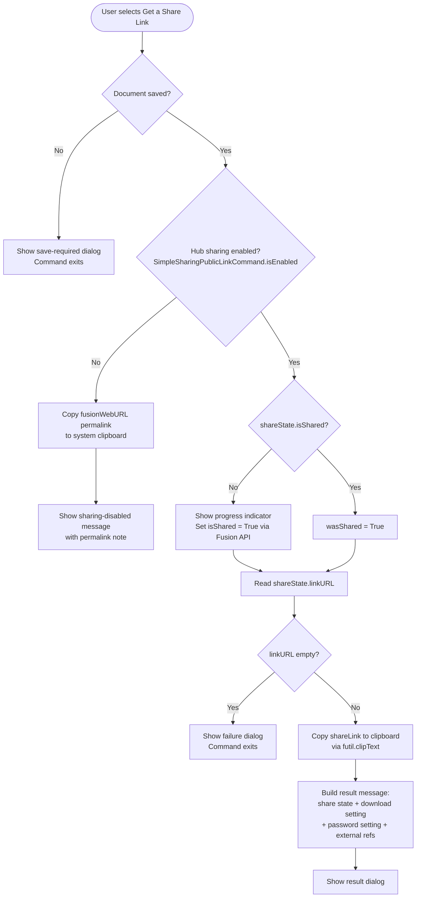

# Get a Share Link

**Enables sharing and copies the public share link to the system clipboard.**

Use this command to generate a publicly accessible URL for the active Autodesk Fusion document. You can paste the link into email messages, chat messages, or any other text to give colleagues or external reviewers browser-based access to the design — without requiring them to have Autodesk Fusion installed.

---

## When to use this command

| Scenario | Recommendation |
|---|---|
| Send design for review to someone outside your organization | Use **Get a Share Link** |
| Share with someone who does not have Autodesk Fusion installed | Use **Get a Share Link** |
| Share with a team member who needs edit access in Fusion | Use [Get Open on Desktop Link](get-open-on-desktop-link.md) instead |
| Share for review through the Fusion Team web viewer | Use [Get Open in Team Link](get-open-in-team-link.md) instead |

---

## How to use this command

1. Open the document you want to share. The document must be saved to an Autodesk Team Hub.
2. Select **Share Menu** in the right Quick Access Toolbar.
3. Select **Get a Share Link**.
4. If sharing has not been enabled previously, a progress indicator appears momentarily while the add-in enables sharing and retrieves the link.
5. A result dialog confirms that the link was copied to the clipboard and reports the current sharing state.
6. Paste the link wherever you need it.

---

## Result dialog

The result dialog confirms that the share link was copied and includes status notes for the following conditions:

| Condition | Dialog note |
|---|---|
| Document was already shared before this command ran | Reported in the result message |
| Downloading from the link is disabled | Noted; directs you to **Change Share Settings** |
| Share link is password protected | Noted in the result message |
| External references present, download enabled | Recipients can download referenced designs |
| External references present, download disabled | Referenced designs can be viewed but not downloaded |

---

## Requirements and limitations

- The document must be saved to an Autodesk Team Hub.
- If the Team Hub administrator has disabled share links for the Hub, a private permalink is copied to the clipboard instead. The private permalink provides Hub members with access to the document details page only — it does not allow public access.
- Enabling sharing requires a network round-trip to Autodesk Platform Services, which may take a few seconds. A progress indicator is shown during this operation.

---

## Architecture — command flow

The following diagram shows what the add-in does when you select **Get a Share Link**.

### Detailed command flow

---

## Key API surface

| API element | Purpose |
|---|---|
| `ui.commandDefinitions.itemById("SimpleSharingPublicLinkCommand")` | Checks whether sharing is enabled for this Hub |
| `app.activeDocument.isSaved` | Guards against operating on unsaved documents |
| `app.activeDocument.dataFile.sharedLink` | Returns the `SharedLink` object for reading and setting share state |
| `sharedLink.isShared` | Reads or sets the sharing enabled state |
| `sharedLink.linkURL` | The public share URL |
| `sharedLink.isDownloadAllowed` | Whether recipients can download the document |
| `sharedLink.isPasswordRequired` | Whether the share link is password protected |
| `app.activeDocument.designDataFile.fusionWebURL` | Private permalink used when Hub sharing is disabled |
| `futil.clipText(text)` | Copies the link to the system clipboard |

---

## Related commands

- [Change Share Settings](change-share-settings.md) — Modify download permissions and password protection after sharing is enabled.
- [Get Open on Desktop Link](get-open-on-desktop-link.md) — Generate a link that opens the document for editing in Fusion.
- [Get Open in Team Link](get-open-in-team-link.md) — Generate a link that opens the document in the Fusion Team web viewer.
