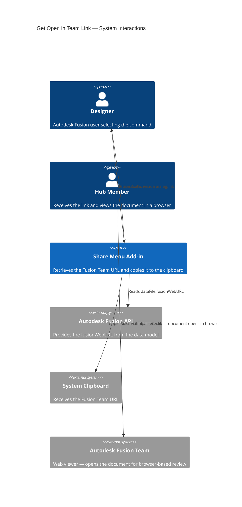
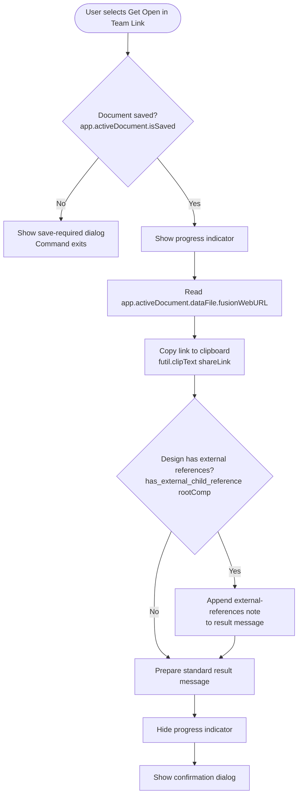

# Get Open in Team Link

**Copies to the system clipboard a direct link that opens the active document in the Autodesk Fusion Team web viewer.**

Use this command to generate the Fusion Team web URL for the active document. When a team member selects this link, the document opens in the Autodesk Fusion Team web viewer in their browser — no Fusion desktop installation required. This link type is most useful for extended team members such as stakeholders, reviewers, and project managers who need to view a design without working in the Fusion desktop application.

---

## When to use this command

| Scenario | Recommendation |
|---|---|
| Share with someone who needs browser-based review without installing Fusion | Use **Get Open in Team Link** |
| Share with a Hub member who needs editing access in Fusion | Use [Get Open on Desktop Link](get-open-on-desktop-link.md) instead |
| Share with someone outside your organization | Use [Get a Share Link](get-a-share-link.md) instead |

---

## How to use this command

1. Open a document that is saved to an Autodesk Team Hub.
2. Select **Share Menu** in the right Quick Access Toolbar.
3. Select **Get Open in Team Link**.
4. A progress indicator appears briefly while the link is retrieved.
5. A confirmation dialog reports that the link was copied to the clipboard and notes any external references present in the design.
6. Paste the link into an email, chat message, or other communication channel.

When the recipient selects the link, the document opens in the Autodesk Fusion Team web viewer in their browser.

---

## External references note

If the active design contains external component references, the confirmation dialog adds the following note:

> *This design has external references. Sharing this design may share the referenced designs depending on the team member's permissions.*

The recipient must have Hub access permissions that include the referenced designs for the full assembly to display correctly.

---

## Requirements and limitations

- The document must be saved to an Autodesk Team Hub.
- The recipient must have access to the Hub that contains the document. The Fusion Team web viewer enforces Hub authentication — recipients who are not Hub members cannot use this link to view the document.
- This command generates the document's native Fusion Team URL and does not create a new public share link. To share with people outside your Hub, use [Get a Share Link](get-a-share-link.md) instead.

---

## Architecture — command flow

The following diagram shows what the add-in does when you select **Get Open in Team Link**.

### Detailed command flow

---

## Comparison with Get Open on Desktop Link

| Attribute | Get Open in Team Link | Get Open on Desktop Link |
|---|---|---|
| Link format | `https://` Fusion Team web URL | `fusion360://` custom URI scheme |
| Recipient requirement | Hub membership + browser | Hub membership + Fusion installed |
| Opens in | Browser (Fusion Team web viewer) | Autodesk Fusion desktop application |
| Use case | Review and view in browser | Edit and author in Fusion desktop |

---

## Key API surface

| API element | Purpose |
|---|---|
| `app.activeDocument.isSaved` | Guards against operating on unsaved documents |
| `app.activeDocument.dataFile.fusionWebURL` | The Fusion Team URL for the active document |
| `futil.clipText(text)` | Copies the link to the system clipboard |
| `has_external_child_reference(component)` | Recursive function that checks the component tree for linked external files |

---

## Related commands

- [Get Open on Desktop Link](get-open-on-desktop-link.md) — Generate a `fusion360://` link for recipients who need editing access in the Fusion desktop application.
- [Get a Share Link](get-a-share-link.md) — Generate a public share link accessible without Hub membership.
- [Document Project Members](document-project-members.md) — Review who has Hub access to view this link.
