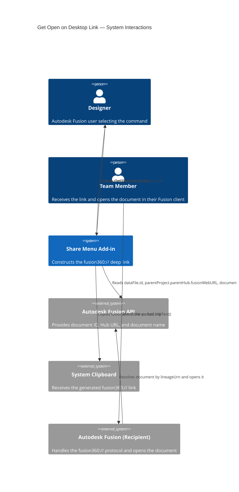
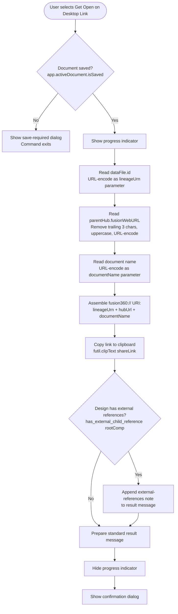

# Get Open on Desktop Link

**Copies a deep link to the system clipboard that opens the active document directly in Autodesk Fusion on the recipient's computer.**

Use this command to generate a `fusion360://` protocol link for the active document. When a team member receives and selects this link, Autodesk Fusion launches on their computer and loads the document automatically — ready for editing. This link is most effective when sharing with design team members who work in Autodesk Fusion and are members of the same Hub.

---

## When to use this command

| Scenario | Recommendation |
|---|---|
| Share with a team member who needs to open the document in Fusion for editing | Use **Get Open on Desktop Link** |
| Share with someone who needs browser-based review without installing Fusion | Use [Get Open in Team Link](get-open-in-team-link.md) instead |
| Share with people outside your organization who may not have Fusion | Use [Get a Share Link](get-a-share-link.md) instead |

---

## How to use this command

1. Open a document that is saved to an Autodesk Team Hub.
2. Select **Share Menu** in the right Quick Access Toolbar.
3. Select **Get Open on Desktop Link**.
4. A progress indicator appears briefly while the link is generated.
5. A confirmation dialog reports that the link was copied to the clipboard and notes any external references present in the design.
6. Paste the link into an email, chat message, or other communication channel.

When the recipient selects the link, Autodesk Fusion opens on their computer and loads the document.

---

## Link format

The generated link uses the `fusion360://` custom URI scheme. It encodes three parameters:

| Parameter | Description |
|---|---|
| `lineageUrn` | The unique document identifier (`dataFile.id`), URL-encoded |
| `hubUrl` | The Hub's Fusion Team URL, URL-encoded (trailing characters are normalized to uppercase) |
| `documentName` | The document name, URL-encoded |

Example structure (values abbreviated):

```
fusion360://lineageUrn=<encoded-id>&hubUrl=<encoded-hub-url>&documentName=<encoded-name>
```

---

## External references note

If the active design contains external component references, the confirmation dialog adds the following note:

> *This design has external references. Sharing this design may share the referenced designs depending on the team member's permissions.*

The recipient must have access to all referenced designs through their Hub membership for the complete assembly to open correctly.

---

## Requirements and limitations

- The document must be saved to an Autodesk Team Hub.
- The recipient must have Autodesk Fusion installed on their computer and be signed in to the same Hub.
- The `fusion360://` protocol handler must be registered on the recipient's computer (this happens automatically when Fusion is installed).
- The recipient must have access permission to the document in the Hub.

---

## Architecture — command flow

The following diagram shows what the add-in does when you select **Get Open on Desktop Link**.



### Detailed command flow



---

## Key API surface

| API element | Purpose |
|---|---|
| `app.activeDocument.isSaved` | Guards against operating on unsaved documents |
| `app.activeDocument.dataFile.id` | The document's lineage URN, used as the primary deep-link identifier |
| `app.activeDocument.dataFile.parentProject.parentHub.fusionWebURL` | The Hub URL encoded into the link so the recipient's client connects to the correct Hub |
| `app.activeDocument.name` | The document name encoded into the link for display purposes |
| `urllib.parse.quote(string)` | URL-encodes each link parameter |
| `futil.clipText(text)` | Copies the assembled link to the system clipboard |
| `has_external_child_reference(component)` | Recursive function that checks the component tree for linked external files |

---

## Related commands

- [Get Open in Team Link](get-open-in-team-link.md) — Generate a browser link for review without requiring a Fusion installation.
- [Get a Share Link](get-a-share-link.md) — Generate a public share link suitable for external reviewers.
- [Change Share Settings](change-share-settings.md) — Control download permissions and password protection for the public share link.

---

*Copyright © 2026 IMA LLC. All rights reserved.*
