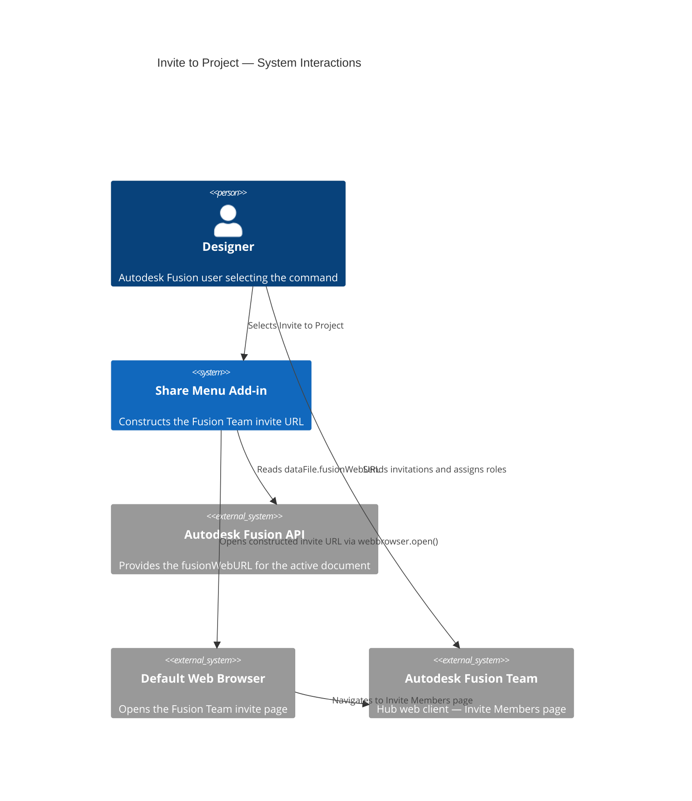
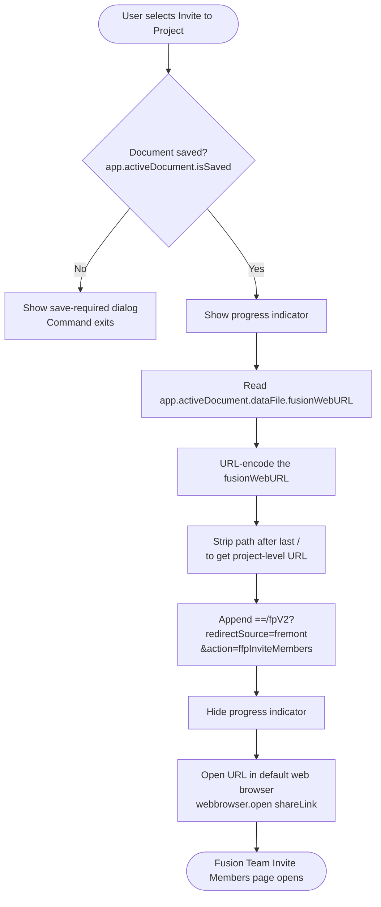

# Invite to Project

**Opens the Autodesk Fusion Team web client to the Invite Members page for the active document's project.**

Use this command to add collaborators to the Hub project that contains the active document. After you send invitations, new members can be granted the appropriate access permissions from within Fusion Team. This command takes you directly to the correct project without requiring you to manually navigate the Fusion Team web interface.

---

## When to use this command

| Scenario | Recommendation |
|---|---|
| Add a new team member to the current project | Use **Invite to Project** |
| View who currently has access to the project | Use [Document Project Members](document-project-members.md) instead |
| Share the document with someone who does not need project membership | Use [Get a Share Link](get-a-share-link.md) instead |

---

## How to use this command

1. Open a document that is saved to an Autodesk Team Hub project.
2. Select **Share Menu** in the right Quick Access Toolbar.
3. Select **Invite to Project**.
4. Your default web browser opens directly to the **Invite Members** page for the project.
5. Enter the email addresses or names of the people you want to invite, assign their role, and send the invitations.

> **Note:** You must have sufficient Hub permissions to invite members. If you do not have permission, contact your Fusion Hub administrator.

---

## Requirements and limitations

- The document must be saved.
- The document must be stored in an Autodesk Hub project. If the document is a local file or has not been saved, this command cannot determine the project context.
- You must have the Hub role that permits inviting members (typically **Admin** or **Project Admin**).
- Your browser must be able to reach `autodesk.com` domains. If your browser blocks pop-ups from these domains, allow them in your browser settings.

---

## Architecture — command flow

The following diagram shows what the add-in does when you select **Invite to Project**.

### Detailed command flow

---

## URL construction

The add-in derives the invite URL from `dataFile.fusionWebURL`, which points to the active document's page on Fusion Team. The construction process:

1. Reads the document's `fusionWebURL` (for example, `https://autodesk.com/team/hubs/.../projects/.../data/.../files/...`).
2. Trims the path to the project level by removing everything after the last `/`.
3. Appends the query string `==/fpV2?redirectSource=fremont&action=ffpInviteMembers` to redirect to the Invite Members page.

---

## Key API surface

| API element | Purpose |
|---|---|
| `app.activeDocument.isSaved` | Guards against operating on unsaved documents |
| `app.activeDocument.dataFile.fusionWebURL` | Base URL used to construct the invite page URL |
| `urllib.parse.quote` / `urllib.parse.unquote` | URL encoding and decoding during path manipulation |
| `webbrowser.open(url)` | Opens the constructed URL in the system default browser |

---

## Related commands

- [Document Project Members](document-project-members.md) — View all current members and their access levels.
- [Get a Share Link](get-a-share-link.md) — Share the document publicly without adding project members.
